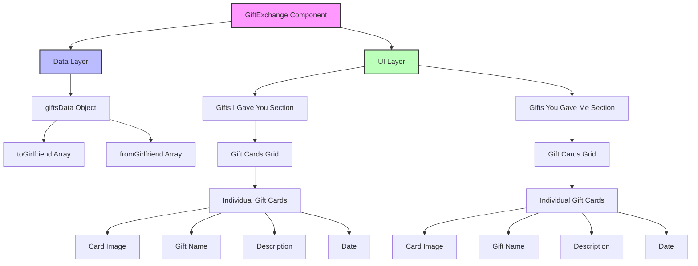

# Gift Exchange Component Flow Chart

## Flow Chart Explanation

### Component Hierarchy
1. **Root Level**
   - GiftExchange Component serves as the main container

2. **Data Management**
   - Data Layer manages the giftsData object
   - Separate arrays for gifts given and received

3. **UI Structure**
   - UI Layer splits into two main sections
   - Each section handles its respective gift display

4. **Card Components**
   - Individual cards display gift details
   - Consistent structure for both given and received gifts

### Data Flow
1. Data flows from giftsData object to respective arrays
2. Arrays are mapped to create grid sections
3. Each grid item renders a complete gift card
4. Cards display all gift information uniformly

### Visual Styling
- Pink: Main component
- Blue: Data management
- Green: UI components 