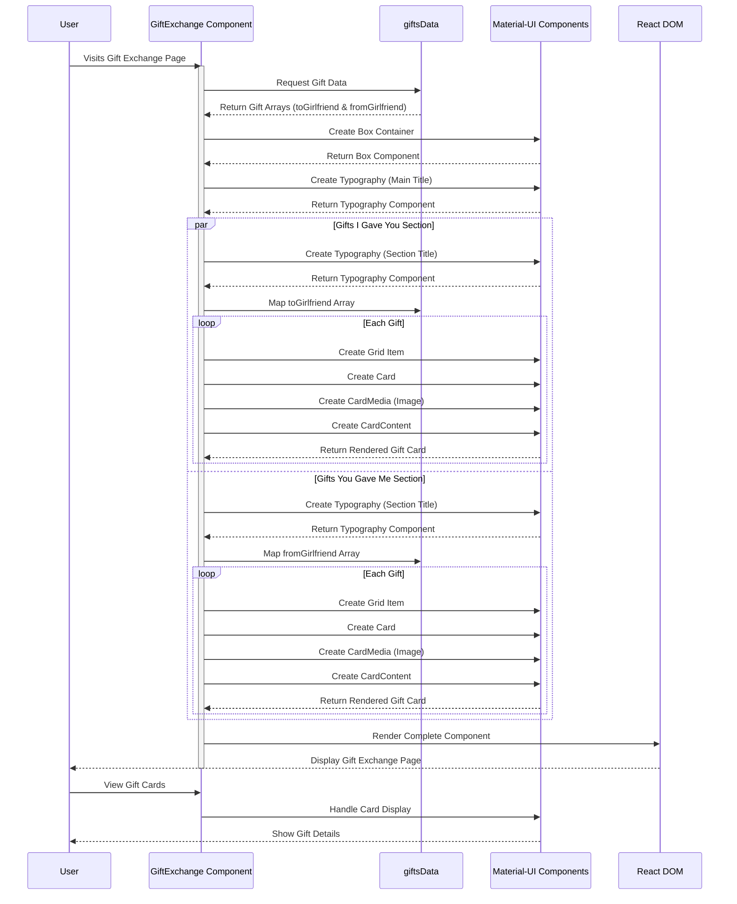

# Gift Exchange Component Sequence Diagram

## Sequence Diagram Explanation

### Initial Load Process
1. **User Interaction**
   - User navigates to Gift Exchange page
   - Component activation begins

2. **Data Retrieval**
   - Component requests data from giftsData
   - Static data is returned immediately

3. **Component Initialization**
   - Creation of main container
   - Setting up typography elements

### Parallel Rendering Process
1. **Gifts I Gave You Section**
   - Section title creation
   - Mapping through toGirlfriend array
   - Individual card creation for each gift

2. **Gifts You Gave Me Section**
   - Section title creation
   - Mapping through fromGirlfriend array
   - Individual card creation for each gift

### Card Creation Process
1. **For Each Gift Card**
   - Grid item container creation
   - Card component initialization
   - Image loading through CardMedia
   - Content rendering with gift details

### User Interaction Flow
1. **Component Display**
   - Final render to React DOM
   - Page display to user

2. **View Interaction**
   - User views gift cards
   - Material-UI handles display states 